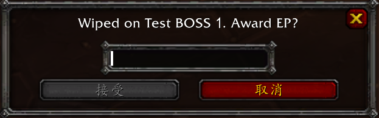

# BOSS Tracking

Automatic boss tracking by means of a popup to mass award EP to the raid and standby when a boss is killed.

## Enable

`ESC` -> `Options` -> `Interface` -> `EPGP` -> `BOSS` -> `Enable`

## Requirement

You must install `DBM` Classic. ([Deadly Boss Mods - CurseForge](https://www.curseforge.com/wow/addons/deadly-boss-mods))

## Usage

In a raid, you must be:
- `Loot Master (LM)` if loot method is `master`
- `Raid Leader (RL)` if loot method is **NOT** `master`
- Have the authority to edit officer's note

After a boss was killed or wipe (if enable `boss wipe`) and out of combat, a frame will popup. Type in a number to mass award EP.

