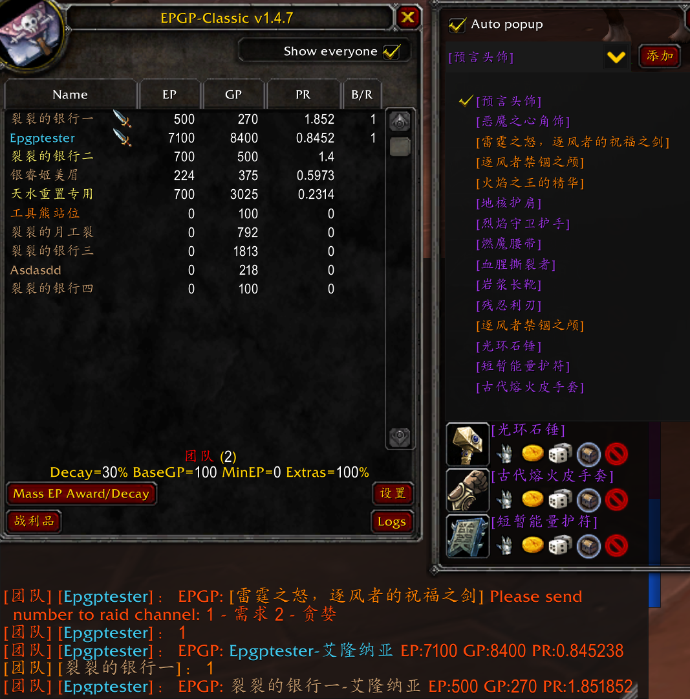

# Loot

Automatic loot tracking by means of a popup to assign GP to the toon that received loot. This option only has effect if you are in a raid and you are either the Raid Leader or the Master Looter.

## Enable

`ESC` -> `Options` -> `Interface` -> `EPGP` -> `Loot` -> `Enable`

## Usage

If you are:
- `Loot Master (LM)` if loot method is `master`
- `Raid Leader (RL)` if loot method is **NOT** `master`

Loots will automatically be added into the list if its quality is beyond the threshold you set. You can add items manually. After you move your mouse on an item, it will appear in the dropped-down list.

Loot frame will open when Blizzard looting UI opened by default. You can disable auto-popup by un-check `Auto popup`. You can also open the frame in EPGP (`/epgp`) -> Loot.

You can start a need/greed, bid, roll by click buttons under one item. You and other members send `number` or `/roll` to `raid` or `whisper` channel (depends on your option). Result will be shown on EPGP main frame and sorted by bid result and PR.

